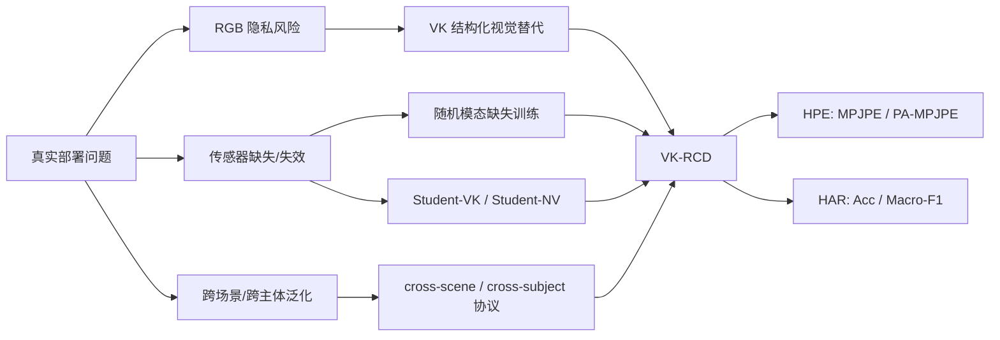
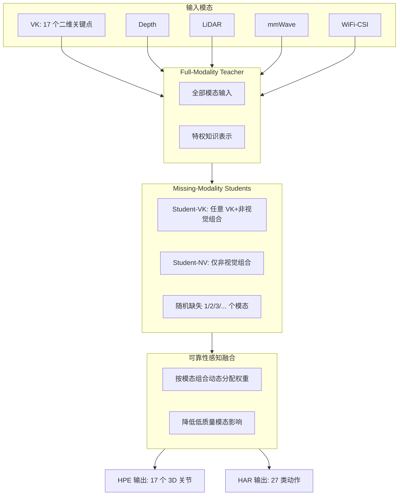
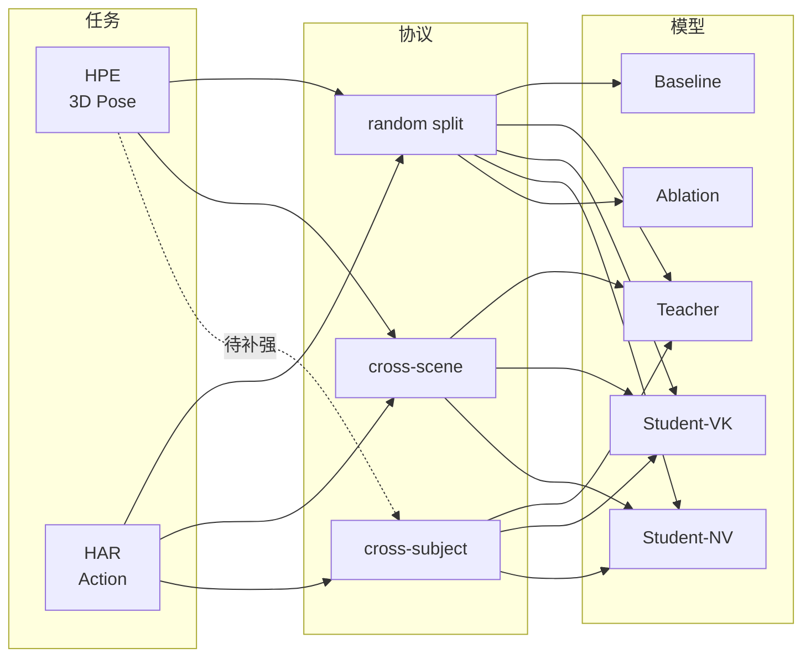
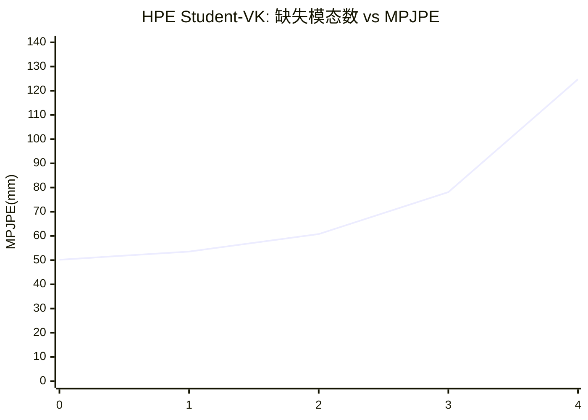
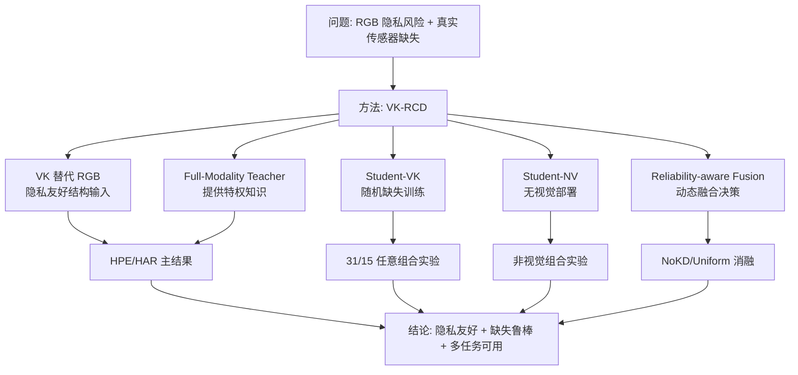
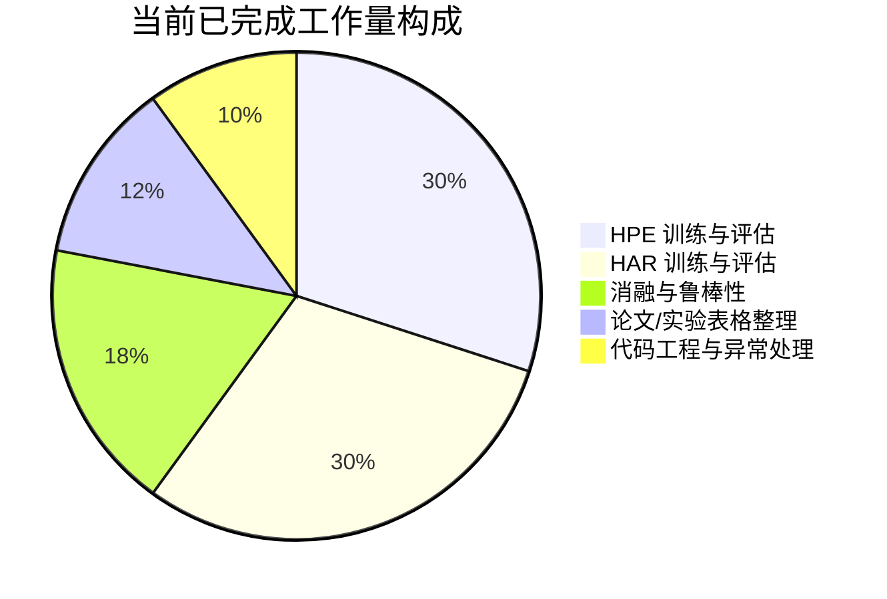
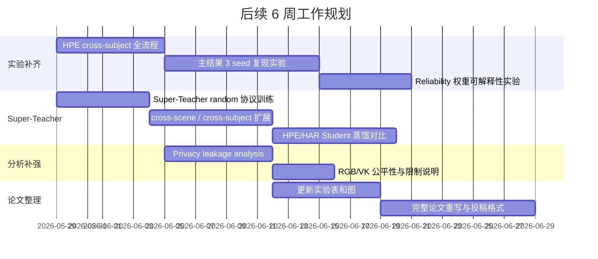
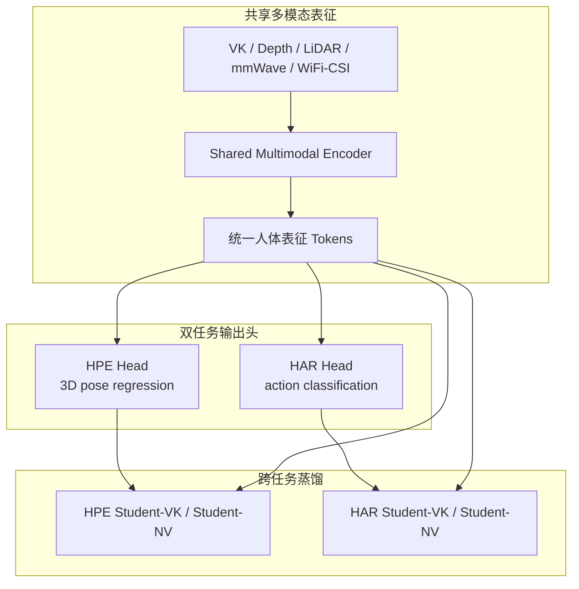

# VK-RCD 阶段性工作总结与后续规划

面向隐私友好与任意模态缺失的人体感知框架

- 基础工作：X-Fi / MM-Fi 多模态人体感知
- 当前改造：移除原始 RGB，使用 VK 结构化视觉输入
- 核心目标：HPE + HAR 两个任务，支持任意模态组合与非视觉部署
- 汇报日期：2026-05-28

---

## 1. 当前工作定位

我们的工作不是简单“RGB 换成 VK MLP”，而是构建一个面向真实部署的多模态人体感知框架：

> 在不使用原始 RGB 的前提下，通过全模态 Teacher、随机模态缺失 Student、非视觉 Student-NV 和可靠性感知融合，实现 HPE/HAR 中任意模态组合的稳定推理。

| 目标 | 说明 |
|---|---|
| 隐私友好 | 不输入原始 RGB，只使用 VK / Depth / LiDAR / mmWave / WiFi-CSI |
| 任意缺失 | 训练阶段随机缺失模态，测试阶段支持任意模态组合 |
| 任务覆盖 | HPE 三维人体姿态估计 + HAR 动作识别 |
| 部署形态 | Student-VK 支持 VK，多传感器；Student-NV 支持无视觉输入 |
| 实验闭环 | random、cross-scene、cross-subject、消融、鲁棒性、复杂度 |

---

## 2. 研究问题与方法主线

图 1：从真实部署问题到 VK-RCD 方案的逻辑链路。

---

## 3. VK-RCD 总体框架

图 2：VK-RCD 的 Teacher-Student 与动态融合流程。

---

## 4. 已完成代码与结果资产

| 模块 | 已完成内容 | 当前状态 |
|---|---|---|
| HPE 代码 | Teacher、Student-VK、Student-NV、Baseline、消融、评估脚本 | 已完成 |
| HAR 代码 | 按 HPE 逻辑完成同构改造 | 已完成 |
| 模态缺失 | HPE 31 组合，HAR 15 组合，非视觉组合 | 已完成 |
| 跨协议 | HAR random/cross-scene/cross-subject；HPE random/cross-scene | 基本完成 |
| 鲁棒性 | HPE VK 噪声、关节缺失 | 已完成 |
| 消融 | NoKD、Uniform、蒸馏变体、复杂度 | 已完成主要版本 |
| 论文材料 | 中文完整论文 PDF、实验部分 PDF、结果表 | 已生成 |

本地同步规模：

- HPE eval CSV：21 个
- HAR eval CSV：14 个
- HPE final_eval：11 个
- HAR final_eval：11 个

---

## 5. 实验覆盖矩阵

图 3：当前任务、协议与模型覆盖情况。

---

## 6. HPE 主结果

HPE 指标：MPJPE / PA-MPJPE，单位 mm，越低越好。

| 模型 | 模态组合 | MPJPE ↓ | PA-MPJPE ↓ | 对比说明 |
|---|---|---:|---:|---|
| Teacher | VK+D+L+R+W | 48.45 | 33.06 | 全模态特权知识源 |
| Student-VK | VK+D+L+R+W | 50.17 | 33.48 | 部署主模型 |
| Student-NV | D+L+R+W | 51.03 | 35.69 | 无视觉部署模型 |
| Student-VK cross-scene | VK+D+L+R+W | 71.70 | 47.74 | 环境迁移仍有下降 |

关键结论：

- Student-VK 全模态达到约 50.17 mm，接近 Teacher。
- Student-NV 在完全不使用 VK 的情况下仍保持较强 HPE 性能。
- cross-scene 明显退化，说明 HPE 的跨环境泛化仍是后续重点。

---

## 7. HPE 任意缺失趋势

| 缺失模态数 | 可用模态数 | 组合数 | MPJPE ↓ | PA-MPJPE ↓ |
|---:|---:|---:|---:|---:|
| 0 | 5 | 1 | 50.17 | 33.48 |
| 1 | 4 | 5 | 53.54 | 34.89 |
| 2 | 3 | 10 | 60.78 | 38.09 |
| 3 | 2 | 10 | 78.11 | 46.84 |
| 4 | 1 | 5 | 124.73 | 68.00 |

图 4：缺失模态越多，HPE 误差逐步上升；单模态部署最困难。

---

## 8. HAR 主结果

HAR 指标：Accuracy / Macro-F1，越高越好。

| 协议 | 模型 | 模态组合 | Acc ↑ | Macro-F1 ↑ |
|---|---|---|---:|---:|
| random | Teacher | VK+D+L+R | 95.57 | 95.56 |
| random | Student-VK | VK+D+L+R | 96.54 | 96.53 |
| random | Student-NV | D+L+R | 96.12 | 96.13 |
| cross-scene | Student-VK | VK+D+L+R | 95.25 | 95.25 |
| cross-subject | Student-VK | VK+D+L+R | 96.12 | 96.10 |

关键结论：

- HAR 的 Student-VK 在 random/cross-scene/cross-subject 下都保持高准确率。
- Student-NV 的非视觉性能接近 Student-VK，说明 HAR 任务中非视觉传感器非常有效。
- HAR 比 HPE 更稳定，适合作为论文中“系统泛化能力”的强证据。

---

## 9. HAR 任意组合与非视觉部署

| 协议 | 模型 | 组合数 | 平均 Acc ↑ | 最优组合 | 最弱组合 |
|---|---|---:|---:|---|---|
| random | Student-VK | 15 | 85.15 | VK+D+L+R / 96.56 | L / 40.80 |
| cross-scene | Student-VK | 15 | 80.61 | VK+D+R / 95.32 | L / 19.98 |
| cross-subject | Student-VK | 15 | 85.30 | VK+D+L+R / 96.12 | L / 38.46 |
| random | Student-NV | 7 | 80.62 | D+R / 96.18 | L / 26.12 |
| cross-scene | Student-NV | 7 | 76.70 | D+R / 95.45 | L / 8.94 |
| cross-subject | Student-NV | 7 | 81.26 | D+R / 95.76 | L / 25.30 |

结论：

- LiDAR 单模态在 HAR 中较弱。
- Depth + mmWave 是非视觉组合中的强组合。
- 任意组合能力不是只靠全模态结果支撑，而是经过全组合评估验证。

---

## 10. 消融实验总结

### HPE 消融

| 设置 | MPJPE ↓ | PA-MPJPE ↓ | 说明 |
|---|---:|---:|---|
| Student-VK 完整目标 | 50.17 | 33.48 | 当前默认模型 |
| NoKD | 48.83 | 32.51 | 单次结果优于默认，需多 seed 验证 |
| Output KD | 47.62 | 32.15 | 单次最优，需要确认稳定性 |
| Uniform Fusion | 52.28 | 37.22 | 等权融合明显变差 |

### HAR 消融

| 设置 | Full Acc ↑ | Avg-15 Acc ↑ | 说明 |
|---|---:|---:|---|
| Student-VK | 96.54 | 85.15 | 完整模型 |
| NoKD | 95.97 | 82.86 | 蒸馏有正向贡献 |
| Uniform | 95.40 | 67.46 | 动态可靠性融合贡献明显 |

---

## 11. 当前论文主线

图 5：论文叙事从问题、方法到实验结论的闭环。

---

## 12. 工作量可视化

已完成工作可以概括为：

- 两个任务：HPE + HAR
- 三类模型：Teacher + Student-VK + Student-NV
- 多个协议：random + cross-scene + cross-subject
- 大规模组合：HPE 31 组合，HAR 15 组合，非视觉组合
- 多类分析：消融、鲁棒性、复杂度、官方 X-Fi 对比

---

## 13. 当前不足

| 不足 | 影响 | 处理策略 |
|---|---|---|
| 方法核心还需要更锋利 | 审稿人可能认为是模块组合 | 凝练 Reliability-Calibrated Missing-Modality Distillation 作为核心算法 |
| HPE cross-subject 未完整闭环 | HPE 证据弱于 HAR | 补齐 HPE cross-subject Teacher/Student/Baseline/组合评估 |
| RGB vs VK 对比存在天然争议 | 公平性容易被质疑 | 明确写成隐私友好结构输入的性能-隐私权衡 |
| 缺少多 seed 统计 | 强会审稿会质疑稳定性 | 主结果补 3 seed，报告 mean ± std |
| 隐私保护还需量化 | 目前偏叙事 | 增加 privacy leakage analysis |

---

## 14. 后续工作规划

图 6：后续实验、分析和论文写作的时间规划。

---

## 15. 未来核心方向：Super-Teacher

Super-Teacher 是下一阶段最重要的“方法拔高点”：从“分别训练 HPE Teacher 和 HAR Teacher”，升级为“一个统一 Teacher 同时学习人体结构与动作语义”。

图 7：Super-Teacher 的共享人体表征与双任务蒸馏逻辑。

---

## 16. Super-Teacher 实现原理

当前 `Super-Teacher/` 分支已经搭建了核心结构：

| 组成 | 实现作用 |
|---|---|
| SharedMultimodalEncoder | 将 VK、Depth、LiDAR、mmWave、WiFi-CSI 编码到统一 token 空间 |
| Modality Embedding | 给不同模态加入显式模态身份，避免随机缺失时顺序混淆 |
| Transformer Fusion | 在统一 token 序列中建模跨模态人体结构信息 |
| HPE Head | 输出 17 个 3D 关节，用 MPJPE、bone loss 等监督 |
| HAR Head | 输出动作类别，用 CE / logit KD 监督 |
| Student Distillation | HPE/HAR Student 从 Super-Teacher 学习 pose/logit/token/reliability 知识 |

核心思想：

> Super-Teacher 不是单任务 Teacher，而是把 HPE 的人体几何结构知识和 HAR 的动作语义知识放进同一个共享人体表征中，再分别蒸馏给 HPE/HAR 的缺失模态 Student。

---

## 17. Super-Teacher 为什么能提升创新度

现在的 VK-RCD 已经能说明“隐私友好 + 任意模态缺失”有效；Super-Teacher 可以进一步回答“方法核心在哪里”。

| 当前版本 | Super-Teacher 版本 |
|---|---|
| HPE/HAR 分别训练 Teacher | 一个 Teacher 同时服务 HPE + HAR |
| 蒸馏主要是单任务内部迁移 | 跨任务共享人体结构与动作语义 |
| 创新点偏系统整合 | 创新点变成统一人体感知表征学习 |
| 证明模型能缺失模态部署 | 进一步证明一个共享 Teacher 能泛化到多任务、多协议、多学生 |

论文中可以这样定义：

> 我们进一步探索 Cross-Task Super-Teacher，使一个隐私友好的全模态教师同时学习 HPE 的几何结构和 HAR 的动作语义，并向不同任务、不同模态可用性的 Student 迁移统一人体表征。

---

## 18. Super-Teacher 需要验证什么

| 实验 | 目的 |
|---|---|
| Super-Teacher vs HPE-only Teacher | 验证 HAR 语义是否帮助 HPE 表征 |
| Super-Teacher vs HAR-only Teacher | 验证 HPE 几何是否帮助 HAR 分类 |
| Student from Super vs Student from single-task Teacher | 验证跨任务 Teacher 蒸馏是否有效 |
| random / cross-scene / cross-subject | 验证跨环境泛化 |
| Student-VK / Student-NV | 验证有 VK 和无视觉部署都能受益 |
| token KD / reliability KD 消融 | 验证跨任务共享表征不是黑盒提升 |

预期结论：

- 如果 Super-Teacher 能提升 Student 的跨场景或缺失模态表现，它就是论文中最强的新方法点。
- 如果提升不稳定，也可以作为未来工作或附录探索，不影响当前 VK-RCD 主线。

---

## 19. 优先级排序

第一优先级：补强论文可信度

1. HPE cross-subject 全流程。
2. HPE/HAR 主结果 3 seed。
3. Super-Teacher random/cross-scene/cross-subject 主实验。
4. Reliability 权重可解释性。

第二优先级：补强创新叙事

1. 将方法核心命名为“可靠性感知缺失模态蒸馏框架”。
2. 将 Super-Teacher 作为“跨任务统一人体表征蒸馏”扩展。
3. 增加隐私泄露分析。
4. 明确 RGB 与 VK 的性能-隐私权衡。

第三优先级：投稿整理

1. 统一所有表格格式。
2. 修复 metadata 可疑项说明。
3. 把实验 PDF 内容整合进正式论文实验部分。

---

## 20. 对外汇报一句话

> 我们提出 VK-RCD，一个面向隐私友好与任意模态缺失部署的多模态人体感知框架。它移除原始 RGB 输入，使用 VK 结构化视觉表示，并通过全模态 Teacher、随机缺失 Student 和可靠性感知融合，在 HPE 与 HAR 两个任务、多种协议和大量模态组合下验证了稳定性能。

更短版本：

> VK-RCD 不是简单替换 RGB，而是面向真实部署的隐私友好、缺失鲁棒、多任务人体感知框架。

---

## 21. 当前投稿判断

| 目标 | 当前判断 | 需要补强 |
|---|---|---|
| CCF-B | 有希望 | 补齐 HPE cross-subject，完善统计显著性 |
| CCF-A | 风险较高 | 需要 Super-Teacher 这类更强方法核心、隐私量化、多 seed、权重可解释性 |
| 中文/工程应用类论文 | 较稳 | 当前实验量和系统完整度已经足够形成完整故事 |

最终建议：

- 不要继续盲目加模块。
- 先补齐短板实验，再用 Super-Teacher 强化“为什么这个框架是新的”。
- 投稿前把论文定位从“X-Fi 改造”提升为“隐私友好缺失模态人体感知框架”。

---

## 22. 下一步立即执行清单

- [ ] 跑完 HPE cross-subject：Teacher、Student-VK、Student-NV、Baseline。
- [ ] 启动 Super-Teacher random 协议：joint Teacher、HPE-only、HAR-only。
- [ ] 用 Super-Teacher 分别蒸馏 HPE Student 和 HAR Student。
- [ ] 对比 Single-task Teacher vs Super-Teacher 的 Student 性能。
- [ ] 对 HPE/HAR 主结果跑 3 seed。
- [ ] 导出 reliability fusion 权重，可视化不同模态组合的权重变化。
- [ ] 做 VK 噪声、关节缺失和非视觉部署的综合结论图。
- [ ] 增加隐私泄露分析：RGB vs VK vs 非视觉。
- [ ] 更新实验 PDF 和正式论文。

---

# Q&A 预备

导师/审稿人可能问：

1. 这是不是只是 RGB 换 VK？
2. 蒸馏和随机缺失是不是已有工作？
3. VK 和 RGB 对比是否公平？
4. 为什么 HPE cross-scene 下降明显？
5. 没有 3 seed 是否可靠？
6. Super-Teacher 相比普通 Teacher 新在哪里？

回答核心：

> 我们承认单个模块并非完全首次提出，创新在于面向隐私友好和任意模态缺失部署，将 VK、全模态特权知识、缺失模态蒸馏、非视觉部署和可靠性感知融合统一到 HPE/HAR 多任务框架中，并用大规模组合实验验证其系统有效性。

Super-Teacher 的补充回答：

> 普通 Teacher 是单任务、单输出的教师；Super-Teacher 是跨任务共享人体表征的教师，它同时学习 HPE 的几何结构和 HAR 的动作语义，并把这种统一表征蒸馏给不同任务、不同模态组合的 Student。这可以把本文从“系统整合”进一步提升到“跨任务人体感知表征学习”。
